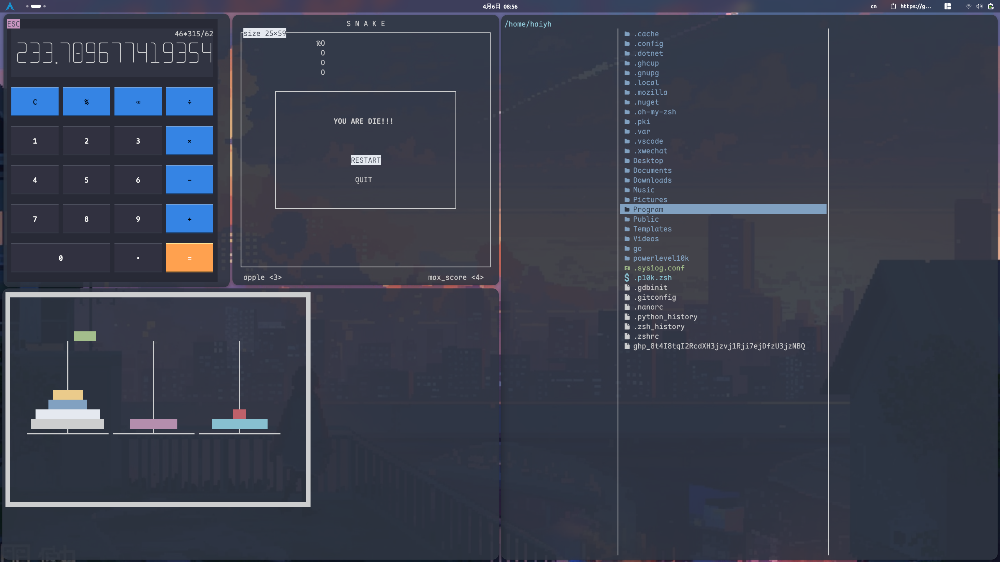

# EzTerm

> v1.4.0

轻封装,高性能,简洁直观的 C/C++ TUI终端界面库



# 快速开始

## EzTerm拥有两个分支, main分支的C++版本和ezterm.c分支的轻量C版本(实验阶段)

### 主版本依赖: 类Unix系统, C++环境(C++版本要求为17)

**编译**
```bash
make
```

**安装**
```bash
make install
```

**卸载**
```bash
make remove
```

**你可以在src/ezterm.cpp文件中最底部追加main函数, 然后编译成临时可执行程序**
```bash
make test
```

**清理构建过程中间文件**
```bash
make clear
```

### C版本单头文件, 直接include, 支持到C99及以上

## 重要说明

C版本与C++有一些差别, 很多依赖C++特性的地方做了更改, 用法基本相同, 行为一致, 具体见ezterm.c下README  

**EzTerm**在 *v1.4.0* 废除了WINDOW相关函数, 你依然可以使用他们, 但会收到警告  
WINDOW存在问题, unicode不支持, 自动折行计算可能导致unicode字符 错乱\截断\乱码, 将在之后的某个版本移除或重构

# 项目说明

> 为什么要做EzTerm?

有段时间喜欢研究TUI, 用了一段时间的 **ncurses**, 感觉虽然强大, 但历史包袱太重, 机制复杂, 函数多且名字古怪, 不够易用, 而且对现代终端模拟器和PC键盘的支持不佳

后来听说 **NeoVim** 用的 *不是* **ncurses**, 原因就是它偏重, 不够现代, 才让我真正产生了自己造轮子的想法, 想要写一个 ***轻量简单的TUI库***, 取代古老的 **ncurses**, 也更深一步地了解自己喜爱的TUI (类Unix系统终端)

# 特色

## 轻封装, 过程式

发现很多现代终端库都是高度抽象的

> 如python华丽的终端文本界面库`textual`,  go的`bubble tea`,`termui`, C++这边的代表 `FTXUI`

或许因为我是从 **ncurses** 过来的, 喜欢那种原始的操作终端屏幕的方式, 不太习惯这种面向对象, 组件驱动的开发方式, 所以

>**EzTerm** 使用了类curses终端库的风格, 低抽象, 过程式, 提供各种函数, 让用户精确绘制每一个字符  

对我来说, 最理想的开发方式就是有库能让我将终端作为一块画布, 给我一些函数让我能在上面自由地绘制任何字符, 而不是组件的堆砌, 说实话这很C, 不够现代, 但我喜欢 :-)

## 灵活

是的, 手动控制每一个字符, **EzTerm** 只提供基础能力, 保证其本身性能足够, 组件的抽象封装由你自己来做, ***细粒度控制***

很原始, 但这就是我习惯的方式, 简单直观易于学习, 到 **FTXUI** 我反而懵了, 所以...见仁见智吧

## 极简

源码单文件, 头文件只有一个, 函数数量约40个, 看看头文件和文档就能上手的那种

我也在尽可能的让代码易读易理解, 希望大家能通过源码学到些什么 (详见初衷)

# 初衷

最初, 我只听说, 在类Unix家族的终端中, 一切 颜色\样式\光标移动\清屏\模式设置 等等等等都是由一种叫 ***ANSI转义序列*** 的东西控制的, 并且有一套自己的标准
> ANSI转义序列: 以\033(也就是ESC)开头, 字母结尾的序列, 能被终端识别并产生效果, 是终端的特殊语言

于是我认为这很简单, 不就是查查表格, 看看标准文档吗

但真正到了自己写的时候, 找不到所谓的"标准文档", 网上搜到的资料零零散散, AI给的不靠谱, 同一个序列不同终端上行为不同, 各种兼容性问题, 还有键盘功能键的序列, 很多知识完全是空白的

这也是为什么我尽力让**EzTerm**的源码易于理解, 我希望那些像我一样想要深入了解终端的人不需要经历这样的痛苦过程, 可以直接来读**EzTerm**源码, 所有 函数的功能 和其内部 转义序列的行为 清晰对应, 你需要的常用功能那里都有, 想自己封装或者写一个更现代更高级的 *TUI库* 也非常容易

> 写**EzTerm**的时候还尝试读过**ncurses**的源码, 结果面对一大堆源码文件, 半天都没能找到某个函数的定义, 函数层层的嵌套封装, 遂劝退


# 原理简介

> **EzTerm**本质上只是封装 **ANSI序列** 和 **系统调用**

## 不同于**ncurses**

ncurses面向WINDOW, 使用"窗口"结构体, 这是一个大型的容器, 记录了窗口上所有字符的属性, 还包括**脏块标记**, 和窗口自己的信息, 大部分函数都是对"窗口"进行操作, 每次刷新由`refresh()`,`wrefresh()`函数扫描整个窗口, 它们会识别 **标记为"脏"** 的区域, 然后还会根据环境做兼容处理 (比如不同终端模拟器 个别序列可能不通用) 生成出一大长串东西, 包含 **ANSI转义序列** 和 **字符**, 然后将这一大串打到终端上
- 优点: 
    > 兼容性好, ncurses要适配不同的终端, 包括历史上很多老旧的终端机, 并且将碎片化IO变成大型低频IO, 减小频繁进行write系统调用的开销  

- 缺点:
    > 历史包袱重, 代码复杂, 频繁刷新开销极大

**EzTerm** 使用内置的轻量字符流缓冲区, 刷新时将缓冲区(字符数组)通过`write()`系统调用写入 stdout , 实现了碎片化IO的合并以提高性能, 减少系统调用  
而 **EzTerm** 的所有函数 比如`printstr()`, `curs_**()` `screen_**()` `attrset_**()`系函数, 直接对应**ANSI序列**, 将其写入到字符流缓冲区中  


# 说明

如果你也喜欢TUI, 爱在终端里干各种事情, 想自己折腾点TUI的小玩意, 并且对TUI应用程序 比如vim,neovim 很有兴趣, 想要深入了解, 那么欢迎来用**EzTerm**

## 源码结构(main分支)

```sh
 EzTerm
│
├──  .clangd  # clangd C++的LSP服务器的配置文件
│
├──  .vscode
│   └──  launch.json
│
├──  bin  # 编译出的二进制
│   ├──  libezterm.a  # 静态链接库
│   └──  libezterm.so  # 动态链接库
│
├── 󱧼 build  # 不用管, 一些临时文件
│   ├──  ezterm.d
│   ├──  ezterm.ii
│   ├──  ezterm.o
│   └──  ezterm.s
│
├──  doc  # 文档,后续可能会向里面加一些说明性质的东西
│   └──  KEY.md  # 关于 键盘功能键序列 的说明
│
├──  include  # 头文件
│   └──  ezterm.h
│
├──  Makefile  # 构建文件
│
├── 󰂺 README.md  # 本文
│
├── 󰣞 src  # 核心:源代码
│   └──  ezterm.cpp
│
└──  test  # 我自己开发过程的测试文件, just for fun
    ├──  bit.cpp  # 模拟一个16位无符号整形溢出的过程(EzTerm和ncurses性能测试)
    ├──  Color_test.cpp  # 颜色功能测试
    ├──  hanoi.cpp  # 好玩的汉诺塔演示程序
    ├──  key_test.cpp  # 我做实验用的键盘按键序列测试
    ├──  Mouse_test.cpp  # 鼠标测试
    ├──  rolling.cpp  # 另一个性能测试程序
```